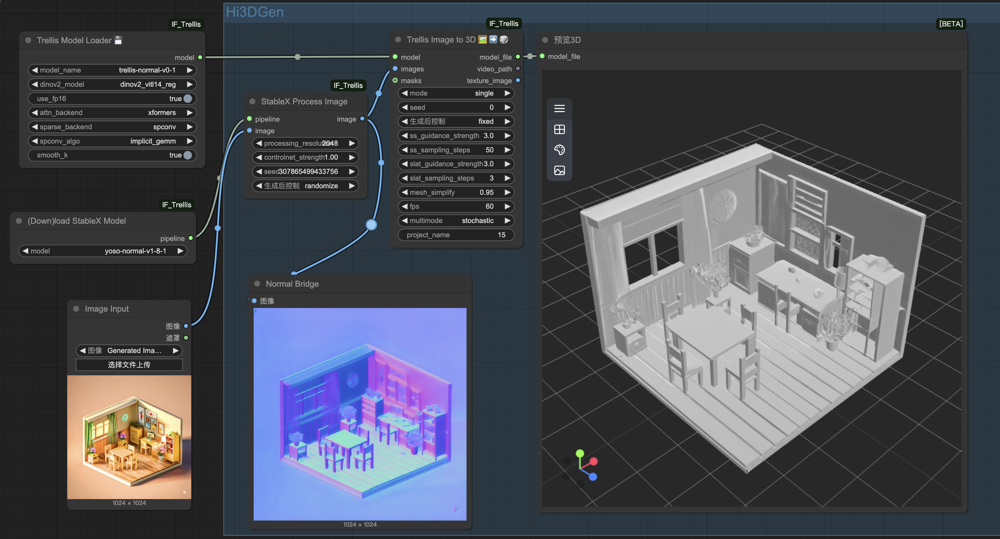

# ComfyUI-Hi3DGen

 
 
 
 
 

This extension integrates [Hi3DGen](https://github.com/Stable-X/Hi3DGen) into ComfyUI, allowing user to generate high-fidelity 3D geometry generation from Images.

## 🔥 Feature Updates
* [2024-03-31] Support single-view image to 3D goemetry generation

## Installation

### From Source (Linux)
* Clone or download this repository into your `ComfyUI/custom_nodes/` directory.
* Install the required dependencies by running `pip install -r requirements.txt`.

### From Source (Window)
WIP, Available before 4.4

## Notes

### Workflows

We provide the example workflows in `workflows` directory.

Note that our code depends on diffusers, and will automatically download the model weights from huggingface to the hf cache path at the first time. The `model_name` in the node corresponds to the model name in huggingface, such as `yoso-normal-v1-8-1`.

## Usage
### Single-view Image to 3D
* `workflow/Hi3DGen_WF_single.json`

## Acknowledgement
This repository builds upon the excellent work in [Trellis](https://github.com/microsoft/TRELLIS), [ComfyUI-IF_Trellis](https://github.com/if-ai/ComfyUI-IF_Trellis) and [ComfyUI-StableXWrapper](https://github.com/kijai/ComfyUI-StableXWrapper). Special thanks to their developers for the foundational work that made this project possible.
